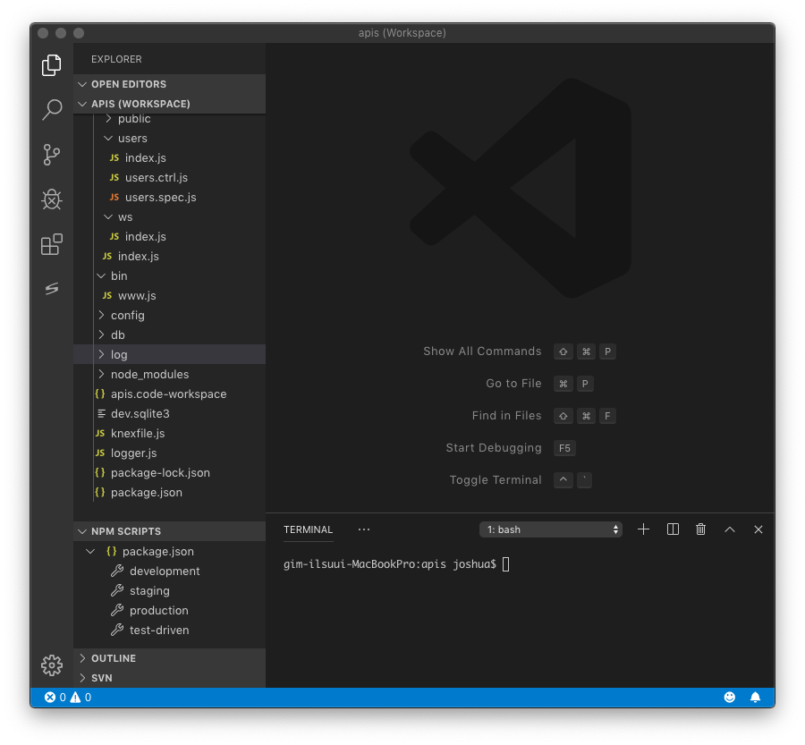

# backend_nodejs 개요

node.js을 활용하여 API 서버를 개발하기 위해서 이 프로젝트를 참고할 수 있습니다. 이 프로젝트는 백엔드 API 서버에 실제로 활용할 목적으로 개발하였으며, 백엔드 서비스를 위한 기초적인 가이드를 제시하기 위한 것입니다.

# 개발 환경

* Visual Studio Code, VSCode Extension: SQLite, StandardJS
```
Version: 1.38.0
Commit: 3db7e09f3b61f915d03bbfa58e258d6eee843f35
Date: 2019-09-03T21:47:00.464Z
Electron: 4.2.10
Chrome: 69.0.3497.128
Node.js: 10.11.0
V8: 6.9.427.31-electron.0
OS: Darwin x64 18.7.0
```
* Node.js: 10.16.3 LTS
* Node Modules (dependencies)
```
app-root-path: ^2.2.1
body-parser: ^1.19.0
config: ^3.2.2
cross-env: ^5.2.1
express: ^4.17.1
express-ws: ^4.0.0
knex: ^0.19.3
morgan: ^1.9.1
mysql: ^2.17.1
poll: ^1.0.1
serve-static: ^1.14.1
sqlite3: ^4.1.10
winston: ^3.2.1
```
* Node Modules (devDependencies)
```
mocha: ^6.2.0
should: ^13.2.3
standard: ^14.1.0
supertest: ^4.0.2
```
* .vscode/launch.json
```
{
    "version": "0.2.0",
    "configurations": [
        {
            "type": "node",
            "request": "launch",
            "name": "Launch Program",
            "program": "${workspaceFolder}/bin/www.js",
            "console": "integratedTerminal",
            "env": {
                "NODE_ENV": "staging"
              }
        }
    ]
}
```

# 실행 방법

* EXPLORER/NPM SCRIPTS 화면에서 test-driven, development, staging, production에 마우스를 올리고 실행 버튼을 클릭하세요


# 기본 요건

API 서버에 관한 기본 요건은 다음과 같습니다.

* 자바스크립트 표준 규칙에 따른 구현 (참고: https://standardjs.com/rules-kokr.html)
* Development, Staging, Production 개발 단계에 따른 실행환경을 지원
* 테스트 주도 개발 (Test Driven Development) 방법론에 따른 테스트 자동화를 지원

## 주요 기능

* REST API를 지원하는 HTTP 서버
* 실시간 데이터를 Push하는 WebSocket 서버
* 설정 파일을 통해 실행 환경을 설정
* 로깅 정책에 따른 로그 파일을 지원

## 멀티 데이터베이스를 지원

다음에서 테스트 되었습니다.

* sqlite3: Test-Drivne, Development
* mysql, mariadb: Staging (debug), Production

## 멀티 OS를 지원

다음에서 테스트 되었습니다.

* 윈도우: Windows10
* 리눅스: CentOS7
* 맥OS: Mojave

# 학습을 통한 개발 과정

JavaScript 개발자는 Node.js 출현으로 이제 Front-end부터 Back-end까지 그 영역을 넓혔습니다. 그러한 기술을 활용해 처음으로 백엔드 개발을 시작하였을 때 이미 많은 분들이 공유한 참고자료를 찾을 수 있었습니다. 그래서 저 역시 유튜브 동영상을 포함해 1주일 선행학습을 한 후, 그 다음 다시 1주일 동안 진행한 개발결과를 공유합니다. 참고 문헌과 출처는 학습을 진행하면서 북마크한 순서대로 다음에 적었습니다. backend_nodejs 개발을 진행한 과정은 다음과 같습니다.

* 우선 백엔드와 API 서버에 대한 정의를 다시 살펴보았습니다.
* 김정환님 강의자료와 기초 자료를 활용해 API 서버의 구조를 잡을 수 있었습니다.
* 자바스크립트 표준 규칙에 따른 구현을 추구하였습니다.
* 세미콜론에 대한 논란이 흥미로웠으며 표준 규칙에 따라 생략하였습니다.
* 자바스크립트 특징과 같은 콜백은 클로저(closer)라는 것을 알았습니다.
* 비동기 방식의 구현을 위해 프로미스(promise), async/await를 ES6에서 지원한 것은 신의 한수라고 생각하였습니다.
* API 서버로서 HTTP 프로토콜 지원을 위해 Express를 지원하고 요청은 GET, POST, PUT, DELETE 메소드로 제한했습니다.
* TDD (Test Driven Development) 방법론을 지원하기 위해 Mocha, Should, SuperTest를 지원했습니다.
* HTTP 요청 메소드에 따른 성공과 실패 상태를 표준 메소드 정의서를 참고하여 지원했습니다.
* MariaDB를 설치하고 DB 지원을 위해 Knex를 지원했습니다.
* Knex는 SQL 문장에 잘 대응하고 있기 때문에 SQL을 잘 아는 개발자에게는 매우 유용합니다.
* Knex를 활용하면 DB 전환에 따른 Migration과 Seeding을 손쉽게 처리할 수 있습니다.
* Migration을 통해 DB를 전환할 때 테이블과 그 관계를 자동으로 생성할 수 있고, Seeding을 통해 테이블 마다 기본 데이터를 자동으로 추가할 수 있습니다.
* JavaScript를 활용해 DB 테이블과 관계를 ORM으로 정의하여 테이블을 객체로 핸들링할 수 있습니다.
* 비즈니스 로직이 성공하거나 실패한 경우에 DB 트랜잭션을 지원하여 자동으로 커밋하거나 롤백하도록 지원했습니다.
* WebSocket을 지원하고, 변경이 생긴 경우에 모든 클라이언트 연결로 실시간 데이터를 보낼 수 있도록 지원했습니다.
* 시스템에 변경사항을 주기적으로 검사하기 위해 비동기 폴링을 지원했습니다.
* Test-Driven, Development, Staging, Production 단계를 구분하여 시작할 수 있는 npm 스크립트를 지원했습니다.
* 단계별로 서로 다른 설정 파일을 참고하도록 분리했습니다.
* Test-Driven, Development 단계에서는 sqlite3을 DB로 사용하고 Staging, Production 단계에서는 MariaDB를 사용하도록 분리했으며, Test-Driven, Development, Staging단계에서는 DB를 사용할 때 debug 수준의 로그가 남기도록 하였습니다.
* 맥OS(모하비)에서 개발한 소스가 윈도우(윈도우10프로), 리눅스(CENTOS7)에서 실행하는데 문제가 없도록 지원했습니다.
* Node.js 성능을 최적화하기 위한 아티클을 학습하였고 특히 비동기 콜백에서 async/await 용법에 문제가 없도록 Jay Kwon님과 동료에 의한 코드 리뷰를 하였습니다. 이에 고맙습니다.

# 참고 문헌과 출처 (2019년 9월 10일 작성)

* 백엔드 기초 다지기 https://backend-intro.vlpt.us
* 김정환 강의자료 https://github.com/jeonghwan-kim/lecture-node-api
* 생활코딩 https://www.youtube.com/watch?v=s8HrD5aOXmE
* 자바스크립트와 세미콜론 https://flaviocopes.com/javascript-automatic-semicolon-insertion/
* 클로저로서 콜백함수 https://victorydntmd.tistory.com/48
* 프로미스 https://joshua1988.github.io/web-development/javascript/promise-for-beginners/
* Async/Await https://medium.com/@constell99/자바스크립트의-async-await-가-promises를-사라지게-만들-수-있는-6가지-이유-c5fe0add656c
* Async pattern https://www.imaginarycloud.com/blog/asynch-javascript-patterns-guide/
* Express Logger 사용법 https://cinema4dr12.tistory.com/822
* Testing Socket.IO With Mocha, Should.js and Socket.IO Client http://liamkaufman.com/blog/2012/01/28/testing-socketio-with-mocha-should-and-socketio-client/
* Method Definitions https://www.w3.org/Protocols/rfc2616/rfc2616-sec9.html
* Node.js 앞단에 Nginx 사용하기 https://cinema4dr12.tistory.com/825?category=494869
* 데이터베이스 통합 https://expressjs.com/ko/guide/database-integration.html
* 맥에서 MariaDB설치하기 http://w3devlabs.net/wp/?p=19736
* 마리아DB https://kamang-it.tistory.com/entry/NodeJSNodeJS와-MysqlMariaDB연동하기-expressJS-상에서-간단한-회원가입로그인회원탈퇴-구현
* MySQL INSERT INTO https://www.w3schools.com/nodejs/nodejs_mysql_insert.asp
* Knex cheatsheet https://devhints.io/knex
* Node.js에서 knex를 이용한 MySQL query https://iamcool.tistory.com/3
* Knex을 활용한 SQL query 만들기 http://knexjs.org/#Schema
* knex transaction with async/await https://github.com/tgriesser/knex/issues/1764
* async / await을 사용하여 knex 트랜잭션 커밋 / 롤백 https://codeday.me/ko/qa/20190621/847086.html
* Chat sample using express-ws https://github.com/y-temp4/express-ws-chat-sample
* Serve-static https://www.npmjs.com/package/serve-static
* How to setup route for websocket server in express? https://stackoverflow.com/questions/22429744/how-to-setup-route-for-websocket-server-in-express
* nodejs의 내부 동작 원리 (libuv, 이벤트루프, 워커쓰레드, 비동기) https://sjh836.tistory.com/149?category=710138
* Seeding your Database with Thousands of Users using Knex.js and Faker.js https://blog.bitsrc.io/seeding-your-database-with-thousands-of-users-using-knex-js-and-faker-js-6009a2e5ffbf
* Express + Knex + Objection = Painless API with DB https://itnext.io/express-knex-objection-painless-api-with-db-74512c484f0c
* Seed Knex PostgreSQL Database with JSON Data https://medium.com/@jaeger.rob/seed-knex-postgresql-database-with-json-data-3677c6e7c9bc
* Performance Comparison: Java vs Node https://www.tandemseven.com/blog/performance-java-vs-node/
* Creating a non-blocking Polling system in Node.js (with setTimeout and EventEmitter) https://medium.com/@xaviergeerinck/creating-a-non-blocking-polling-system-in-node-js-with-settimeout-and-eventemitter-4aaa098d25fb
* PubSubJS is a topic-based publish/subscribe library written in JavaScript. https://www.npmjs.com/package/pubsub-js
* Cross-Env https://www.npmjs.com/package/cross-env
* 8 Tips For Node.js Performance Optimization https://www.tutorialdocs.com/article/nodejs-performance.html

# 라이선스

MIT
